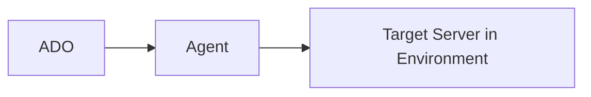

# Markdown
Lightweight markup language for simple text formatting. Easy to read/write with plain text symbols—headers, lists, links, bold, italics. Concise, popular for content creation.

 

## Table Templates
#### table 2 columns

|       header 01         |  header 02    |
|-------------------------|---------------|
| Row 01                  |  Row 01       |
| Row 02                  |  Row 02       |

